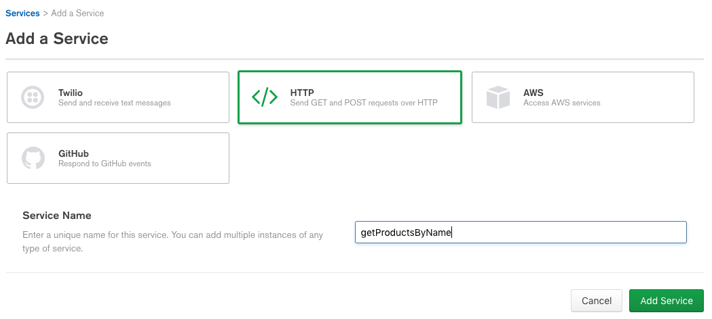
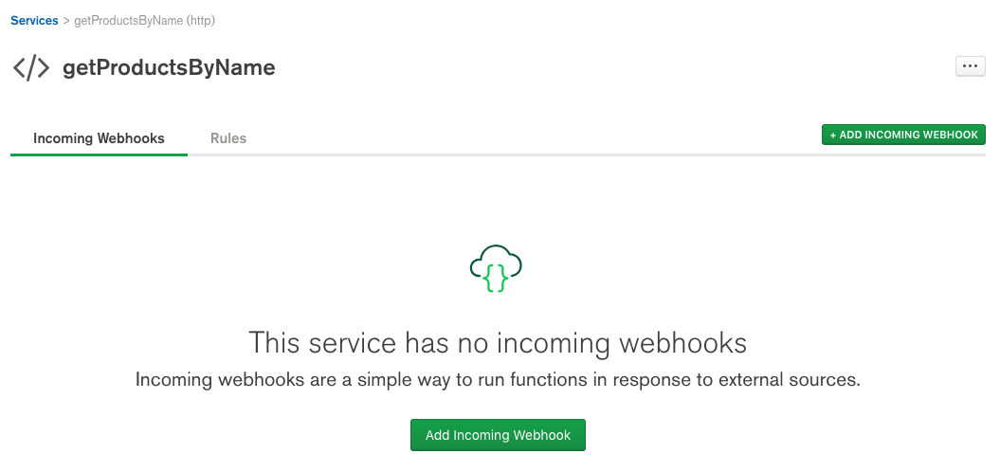
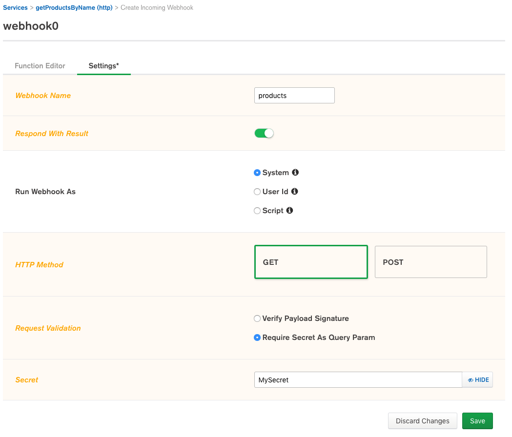
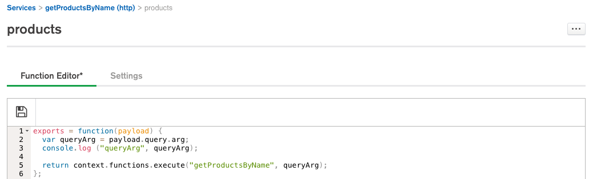
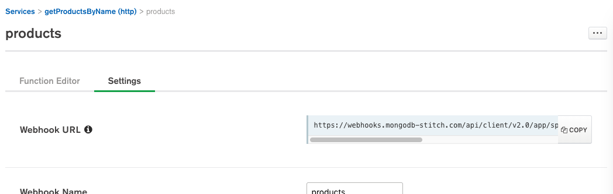
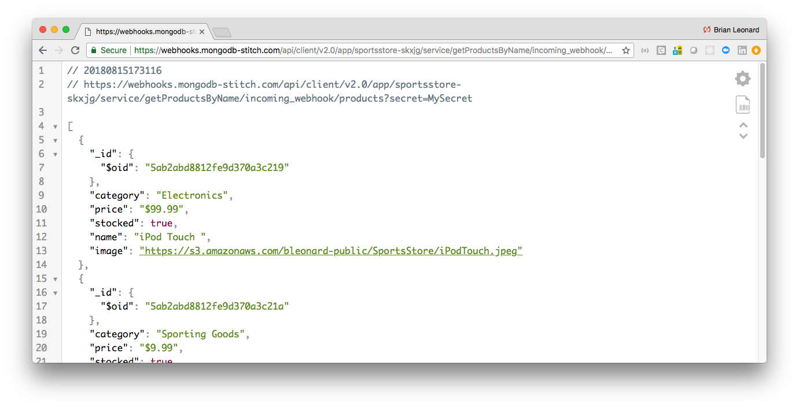
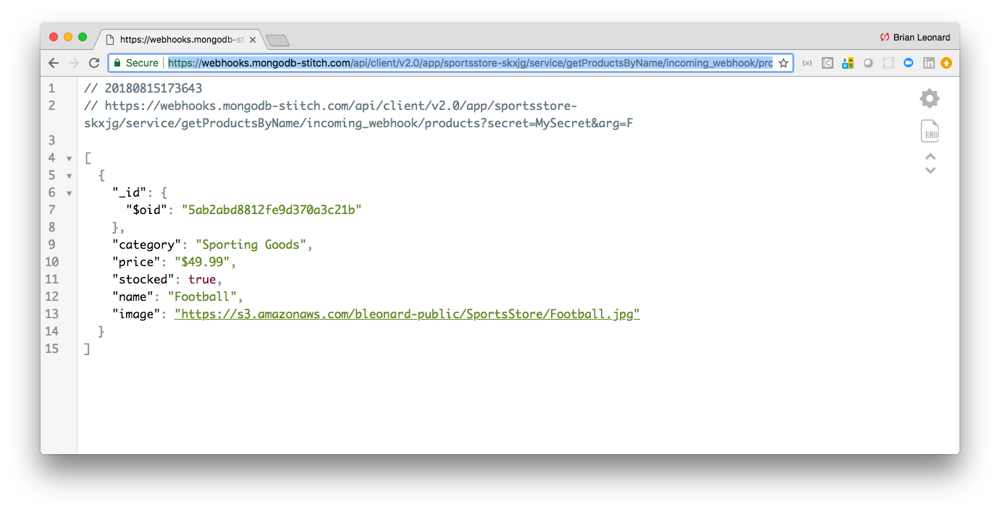

# Using MongoDB Stitch to expose REST APIs

Previously I've wrote about [using Stitch to create a microservices API library](https://github.com/wbleonard/stitch-api-react). However, in that example, I exposed the API via the [Stitch JavaScript SDK](https://s3.amazonaws.com/stitch-sdks/js/docs/master/index.html), which of course requires the SDK be included in your client code. Although I prefer the ease of use of a language specific SDK, I also understand there are times when you want to also expose functionality via a language agnostic REST API. Here, I show you how that can also be achieved by REST enabling the getProductsByName() function used in my SDK example. 

## Prerequisites

Follow the instructions in [Using MongoDB Stitch to Create a Microservices API Library](https://github.com/wbleonard/stitch-api-react) through the point where you [Test the API](https://github.com/wbleonard/stitch-api-react#test-the-api-1).

## Making the API RESTful

We'll use Stitch [Services](https://docs.mongodb.com/stitch/services/), specifically the [HTTP Service](https://docs.mongodb.com/stitch/reference/partner-services/http/) to make the API RESTful.

In the Stitch UI, select **Services** from the menu the left and then click the **Add a Service** button to open the Add a Service page. Select the HTTP service and name it **getProductsByName**:



Click the **Add Service** button to open the Incoming Webhooks page:



As you can see, the HTTP service will be exposed via a webhook. Click the **Add Incoming Webhook** button to open the webhook settings page and set values as shownin the following screen grab (you can set the secret to whatever you like):



Click **Save** to open the Function Editor. Replace the function code with the following, which is simply executing the `getProductsByName` function we've previously created:

In the Function Editor, replace the code with the following:
```javascript
  exports = function(payload) {
    var queryArg = payload.query.arg;
    console.log ("queryArg", queryArg);
  
    return context.functions.execute("getProductsByName", queryArg);
  };
```

Then click the disk icon to save the service function:

 

 ## Using the REST API

 Return to the **Settings** tab and you'll notice Stitch has generated a new **Webhook URL** field:

 

 Copy this URL, append your secret and paste it into your favorite REST tool such as [Postman](https://www.getpostman.com/) or in this case, since it's a GET request, your browser will do:

 [https://webhooks.mongodb-stitch.com/api/client/v2.0/app/sportsstore-skxjg/service/getProductsByName/incoming_webhook/products?secret=MySecret](https://webhooks.mongodb-stitch.com/api/client/v2.0/app/sportsstore-skxjg/service/getProductsByName/incoming_webhook/products?secret=MySecret)



Optionally append an argument to the API call to filter the results:

[https://webhooks.mongodb-stitch.com/api/client/v2.0/app/sportsstore-skxjg/service/getProductsByName/incoming_webhook/products?secret=MySecret&arg=F](https://webhooks.mongodb-stitch.com/api/client/v2.0/app/sportsstore-skxjg/service/getProductsByName/incoming_webhook/products?secret=MySecret&arg=F)



And now you've REST enabled your service.


